# 宏观经济学  
# from Miracle_Zero
## **第二章&emsp;总产出及其衡量**  
---
### **一、国民收入核算中的六个总量**  

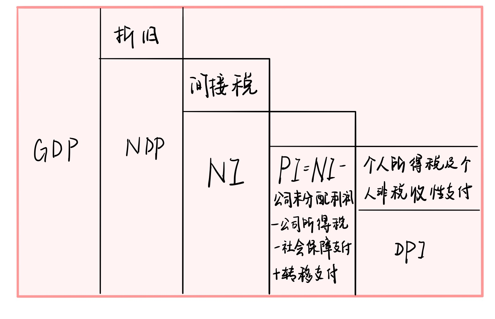
  

#### 1、国内生产总值GDP 
* 一定时期内在**一个国家或地区范围内**所生产的全部**最终产品和劳务**的市场价值总和  
   >（1）GDP是一个**市场价值**概念  
   >（2）GDP统计的是最终产品,而不是中间产品
   >>什么是**最终产品**  
   >**最终产品**：供人们直接使用和消费，不再转卖的产品和劳务  
   >**中间产品**：作为生产投入品，不能直接使用和消费的产品和劳务  
   >>  
   >（3）GDP按照**国土原则**计算，不按照**国民原则**  
   >（4）GDP是**流量**  
   >>**流量**：一定时期内发生或产生的变量  
   >**存量**：某一时点上观测到的变量  
   >>  
   >（5）GDP是一定时期内**生产**的，不是销售掉的  
   >（6）GDP包含折旧

   >**名义GDP**/当年价GDP：按当年价格计算的一年的国内生产总值  
   >**实际GDP**/不变价GDP：按不变价格/基年价格计算的生产总值

#### 2、国民生产总值GNP
* 一个国家或地区一定时期内由**本地公民**所生产的全部最终产品和劳务的市场价值总和  
   >**GDP=GNP-本国公民在国外生产+外国公民在本国生产**  
   >GDP属**地域**，GNP属**身份**  

  

#### 3、国民生产净值NNP与国内生产净值NDP  
* GNP或GDP扣除**折旧**（即GDP与GNP包含了折旧，NNP与NDP不包含折旧）  
* 是一个国家或地区一定时期内财富存量新增的部分

#### 4、国民收入NI与个人收入PI  
* **国民收入NI**：NNP或NDP扣除**间接税**后的余额  
   体现一个国家一定时期内的**生产要素收入**（即工资、利息、租金和利润的总和）  
   >**间接税**：一般在**生产和流通**环节征收，如增值税、营业税、关税  
   >**直接税**：一般在**收入**环节征收，如所得税  
   
   ***广义的国民收入***：国民生产总值GNP

* **个人收入PI**：国民收入进行一些必要的调整后形成  
   体现一个国家一定时期内**个人所得**的全部收入  
   >**NI+**：政府对个人的**转移支付**，如失业救济、退休金、医疗补助  
   >**NI-**：公司未分配利润、公司所得税、社会保障支付  
   PI中还未扣除个人所得税  

#### 5、个人可支配收入DPI  
* **个人可支配收入DPI=个人收入PI-个人所得税**  

---

### **二、国内生产总值的核算方法**  
#### 1、生产法  
* 把一个国家或地区所生产的全部最终产品的市场价格加总来计算GDP  
   >**一个产品在某个生产阶段的增加值**=产品离开生产阶段时的价值-进入生产阶段时的价值  
   >**一个产商的增加值**=厂商生产的产品价值-从其他厂商购买的投入品（中间产品）的价值  
* **增值法**：实际核算中，把所有产品在各个生产阶段上的增加值进行加总的方法  
   >理论上，一个社会所有厂商的**增加值之和**=**最终产品的价值总和**，  
#### 2、收入法  

<strong>Y=C+S+T</strong>
  

<strong>总产出=消费+储蓄+政府税收</strong>
  

#### 3、支出法
* 从产品的去向入手，加总购买者的各类购买支出来计算GDP  
* 又称最终产品法/产品流动法  
*一国经济对产品和服务需求的角度可以划分为**四个部门**：  
   >① **家庭部门**   
   >**消费（C）**：家庭部门对最终产品和服务的支出被称为消费支出  
   >分为三大部分：  
   >&emsp; **耐用品消费支出**（购买小汽车、电视机）  
   >&emsp; **非耐用品消费支出**（购买食品、服装）  
   >&emsp; **劳务消费支出**（医疗、教育、旅游） 
   >家庭的住房购买是投资而非消费   
     
   >② **企业部门**  
   >**投资（I）**：企业部门的支出，即一定是起增加到资本存量上的新的资本流量，包括厂房、设备、住宅  
   >&emsp; **折旧**：资本品的损耗造成的资本存量的减少  
   >&emsp; **重置投资**：为补偿或重新置换已消耗的资本进行的投资  
   >&emsp; **净投资**：使资本存量出现净增加的投资  
   >&emsp;&emsp;&emsp; **净投资=当年年终资本存量-上年年终资本存量**  
   >&emsp;&emsp;&emsp; **总投资=净投资+折旧**  
   >&emsp; 总投资还可分为**固定投资**和**存货投资**  
   >&emsp;&emsp;&emsp; **固定投资**：对固定资产的购买  
   >&emsp;&emsp;&emsp; **存货投资**：企业持有的存货价值的变化  
   >&emsp;**当年存货投资**=当年年终存货价值-上年年终存货价值  
   
   >③ **政府部门**  
   >**政府购买（G）**：政府部门购买产品和服务的支出  
   >&emsp;包括**政府购买**与**政府转移支付**（政府转移支付属于收入再分配，不构成GDP）
       
   >④ **国际部门**  
   >**净出口（NX）**：衡量国际部门对一国产品和服务的支出  
   >&emsp;&emsp;&emsp;**净出口（NX）=出口额（X）-进口额(M)**  
   >>NX>0时，一国经济存在贸易盈余或贸易顺差  
   >>NX=0时，一国经济达到，贸易平衡  
   >>NX<0时，一国经济存在贸易赤字或贸易逆差  
   >  
   
   
<strong>GDP=C+I+G+NX</strong>

#### 4、贡献率的计算
---
### **三、总产出核算的校正**  
#### 1、消费价格平减指数（通货膨胀率）  
* 名义GDP=实际GDP*消费价格平减指数  
#### 2、购买力平价  
* 体现两国货币实际购买力的换算  
#### 3、GDP指标的局限  
* GDP的水平受汇率影响  
* GDP不能完全反应福利水平  
* GDP没有包括非市场活动和地下经济  
* GDP没有考虑资源消耗和环境破坏  
---
---
## **第三章&emsp;短期经济波动模型：产品市场的均衡**  
---  
### **一、国民收入决定原理**  
#### **1、四部门经济模型**  

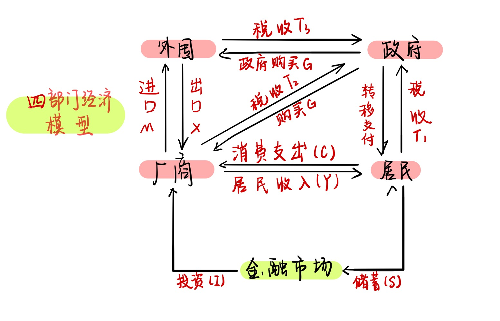
  

<strong>总产出（收入视角-收入去向）：Y=C+S+T+M</strong>

<strong>总产出（支出视角-产品去向）：Y=C+I+G+X</strong>

#### **2、凯恩斯简单国民收入决定原理**  
* 现实经济包含：  
   &emsp;&emsp;四个部门：**居民、厂商、政府、外国**  
   &emsp;&emsp;四部分产品需求：**居民消费C、厂商投资I、政府购买G、净出口NX**  

* **四部门经济均衡国民收入的决定条件**： 

<strong>Y=C+I+G+NX</strong>

---  
### **二、消费需求和储蓄**  
#### 1、消费函数与消费倾向  
* **消费函数**：影响消费支出的因素很多，但最主要的是**国民收入水平** 

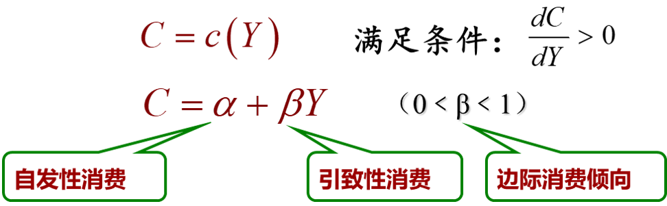
  

* **消费曲线**  

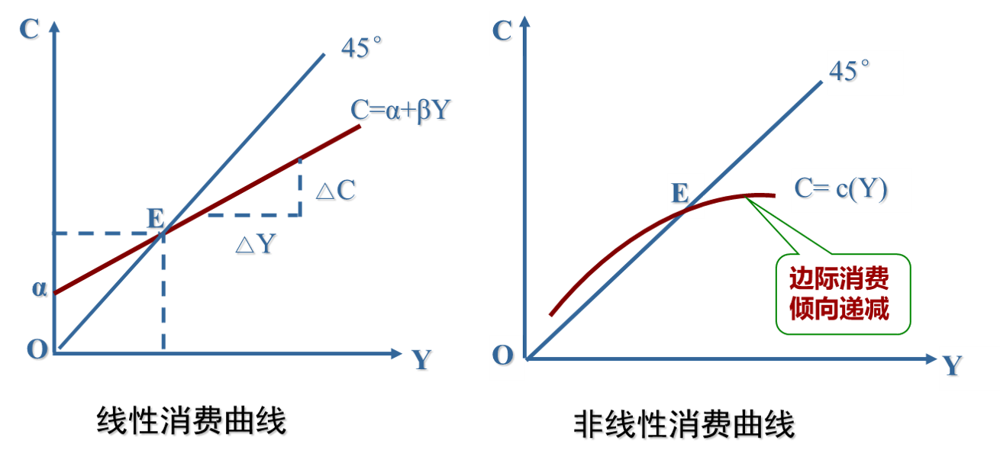
  

&emsp;&emsp;> 注意  
&emsp;&emsp;1、45°线为收支相抵线  
&emsp;&emsp;2、消费曲线在纵轴上的截距α为**自发消费**  
&emsp;&emsp;3、消费曲线向右上方表示消费随收入增加而增加，斜率β为**边际消费倾向**  
* **消费倾向**：消费与收入的比率  

  

&emsp;&emsp;APC：消费函数的平均斜率，可以大于1小于1等于1  
&emsp;&emsp;MPC：消费函数某个点的斜率，0<MPC<1  
&emsp;&emsp;当消费函数为线性时，MPC为常数β  
&emsp;&emsp;当消费函数为非线性时，**MPC、APC随收入增加递减**
* **长期消费函数**：当先行消费函数中的α=0时，APC=MPC，不随收入增加而改变  

<strong>C=kY</strong>
  

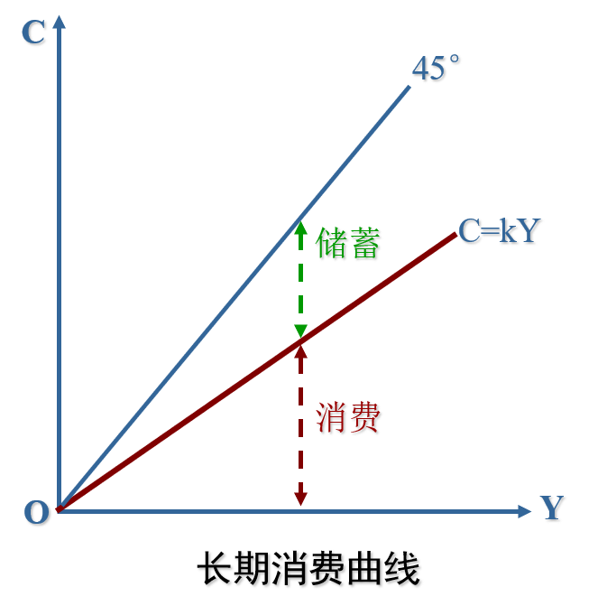
  

&emsp;&emsp;长期消费曲线在收支相抵线（45°）以下  
&emsp;&emsp;随着收入增加，消费和储蓄的绝对量增大  

#### 2、储蓄函数与储蓄倾向  
* **储蓄函数**：影响储蓄的因素中最重要的是**国民收入**（社会总储蓄取决于国民收入） 

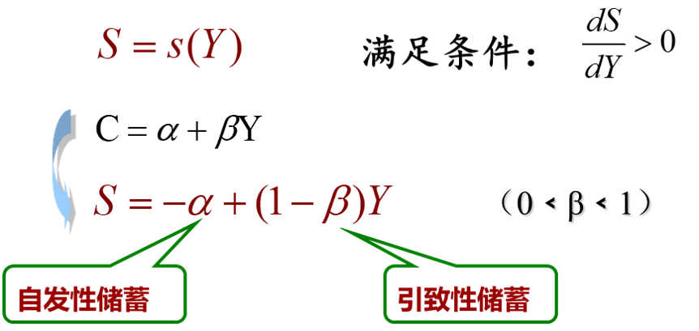
  

* **储蓄曲线**

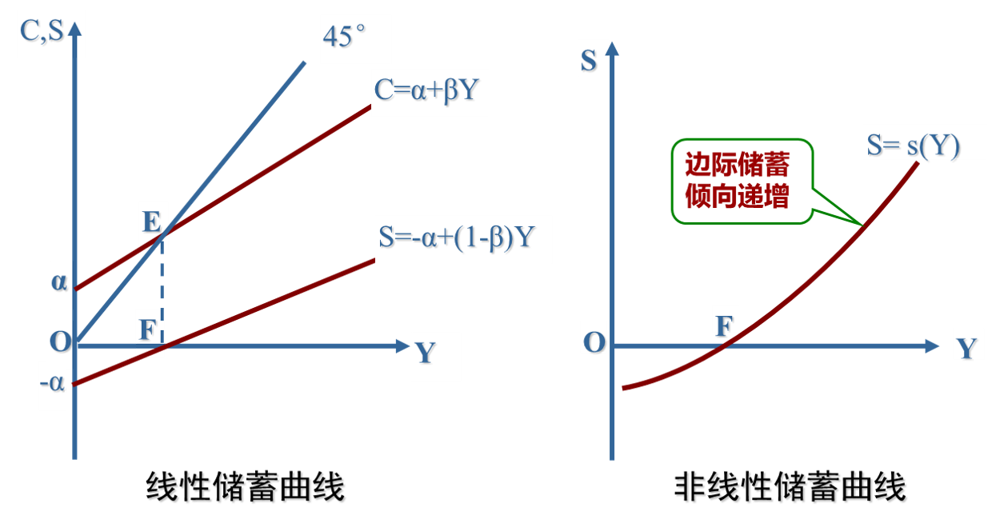

&emsp;&emsp;>注意：  
&emsp;&emsp;1.储蓄曲线在纵轴上的截距-α表示与自发消费α相对应的**负储蓄**  
&emsp;&emsp;2.储蓄曲线与横轴的交点F表示与E点相对应的**零储蓄**  
&emsp;&emsp;3.储蓄曲线向右上方倾斜，表示储蓄随收入的增加而增加   
*  **储蓄倾向**：储蓄与收入的比率  

&emsp;&emsp;当储蓄函数为线性时，MPS为常数**1-β**  
&emsp;&emsp;当储蓄函数为非线性时，MPS将随收入增加而增大  
&emsp;&emsp;**MPS∈（0,1）**

* **长期储蓄曲线**：当α=0时，APS=AMS，且不在随着收入增加而增加  

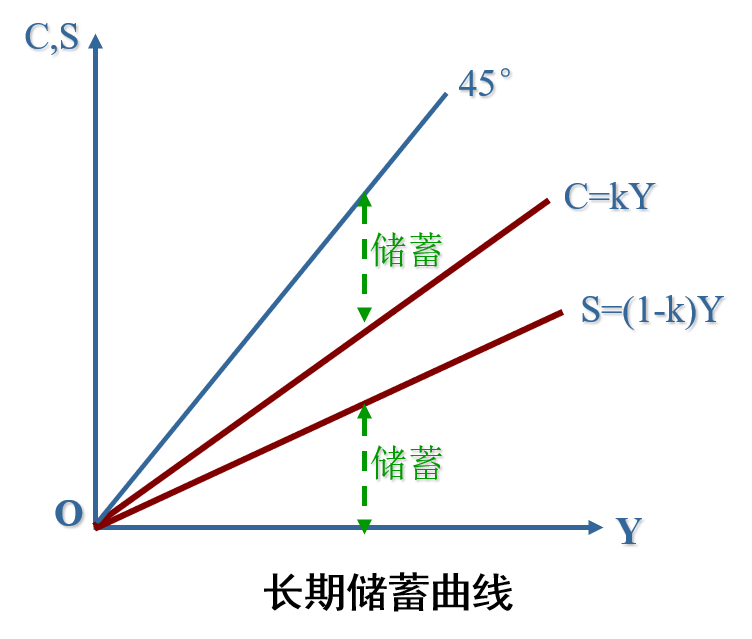
  

&emsp;&emsp;  长期储蓄曲线位于长期消费曲线**下方**，表明正常情况下消费一般大于储蓄  
&emsp;&emsp;  随着收入水平的提高，消费与储蓄的绝对差距会不断**扩大**  
#### 3、影响消费的其他因素  
>**国民收入分配状况**—国民收入分配越平均，平均消费倾向越大  
>**政府税收政策**—实行累进个人所得税，平均消费倾向变大  
>**公司未分配利润所占比例**—占比大，平均消费倾向变小  
>**利率**—依利率变动的替代效应和收入效应而定  
>**价格水平**—货币收入不变时，若物价上升，实际收入下降，平均消费倾向提高  
>**预期**—如预期收入增加，则当前消费会增加，消费倾向提高。如预期价格上涨，则当前消费会增加，消费倾向提高  
>**人口年龄结构**—年青人和老年人比例高，消费倾向高；中年人比例高，消费倾向低  

#### 4、其他消费理论  
* **相对收入假说**（杜森贝利）：消费者的当期消费除了取于当期的收入外，还取决于过去的消费水平以及周围人群的消费水平，消费是相对地决定的 
* **恒久收入假说**（弗里德曼）：消费者的消费支出不是由现期收入决定，而是由恒久收入决定 

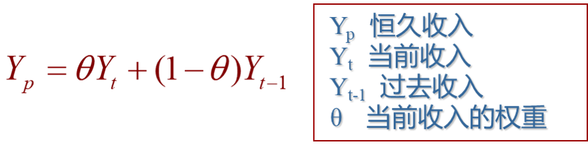
  

>当经济衰退时，虽然当前的收入水平降低了，但消费者仍按恒久收入消费，故衰退期的APC高于长期APC。相反，当经济繁荣时，尽管当前的收入水平提高了，但消费者仍按恒久收入消费，故繁荣期的APC低于长期APC 

* **生命周期假说**（莫迪利安尼）：人们在特定时期的消费不仅仅由他们在该时期的收入决定，人们会在更长的时间范围内**计划消费开支**，以达到在整个生命周期内消费的最佳配置 
>一般说，年青时收入偏低，其消费会超过收入；在中年时期，消费会少于收入，不但可以偿还年青时所欠债务，且可以储蓄以备养老；年老退休时期，收入减少，消费又会超过收入，形成负储蓄

---  
### **三、投资需求的决定**  
#### 1、**投资的定义**：一个国家或地区一定时期内资本的形成和增加  
* **投资的分类**：  
   >按照**投资主体**分：私人投资、政府投资  
   >按照**投资形态**分：固定资产投资、存货投资（又包括意愿性存货投资与非意愿性存货投资）  
   >按照**投资动机**分：生产性投资、投机性投资

#### 2、**投资边际效率**  
（1）**资本边际效率**（MEC）：贴现率，使资本品各年**预期收益的现值**之和等于**供给价格**或重置成本  
（2）**投资边际效率**（MEI）：贴现率，使投资总量各年**预期收益的现值**之和等于**供给价格**或重置成本  

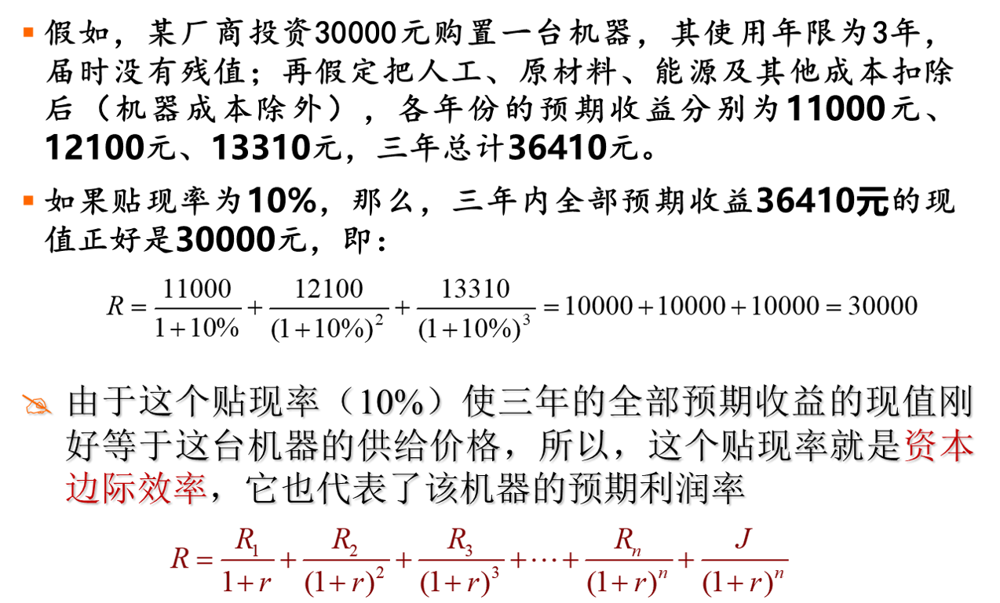

* **资本边际效率曲线MEC与投资边际效率曲线MEI**  
   资本边际效率曲线还不能准确代表厂商的投资需求曲线  
   原因：当利率下降时，如果每个厂商都增加投资，这会带来两方面结果：  
   >1、原材料需求增加->投入品的价格会上涨->导致产品生产成本上升->投资收益降低->资本边际效率必然缩小  
   >2、投资本品形成生产能力投产->所生产的产品供给增加->产品的价格会下降->投资收益降低->资本边际效率也必然缩小

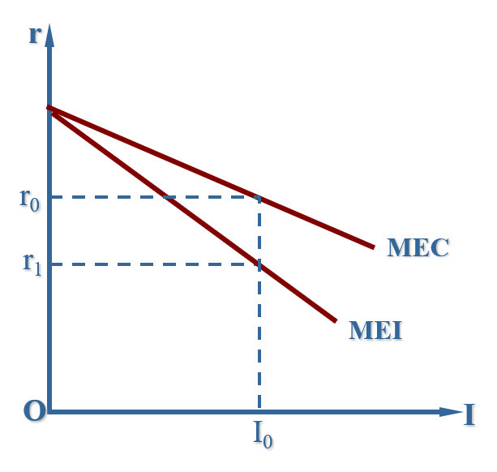

#### 3、**投资函数与投资曲线**  
* **投资函数**：影响投资的因素很多，对私人投资来说，最主要的是**利率水平 r**（即投资取决于利率）  

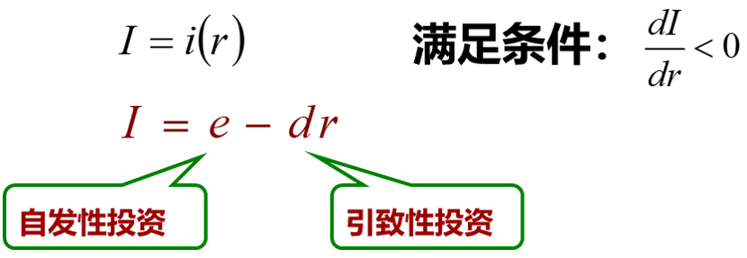

* **线性投资曲线**  

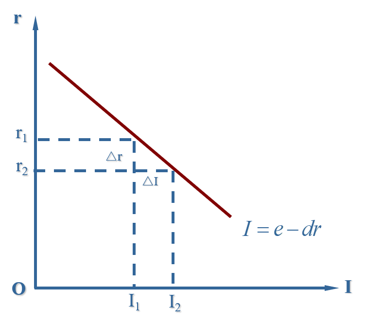

#### 4、其他影响投资的因素  
>**投资环境**—投资环境改善，如投资领域放宽、审批权限下放、税收优惠、贷款贴息、融资条件放宽、土地使用费降低等投资环境的改善，会使投资增加  
>**厂商预期**—厂商对未来经济前景的预期比较乐观，投资就会增加（非意愿存货投资的变化）  
>**技术进步**—技术进步会降低生产成本，使一些过去无法利用的资源得到利用，使一些过去无法解决的环保问题得到解决，能开发新的产品，这些都会增加投资渠道  
>**投资风险**—经济繁荣时，风险偏好增强，投资增加；相反，经济衰退时，风险偏好减弱，投资减少   

#### 5、**投资q理论**  

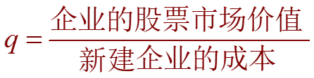
  

>**当q值较大时**：投资需求会较大  
>**当q值较低时**，投资需求会较小
---  
### **四、政府需求**：以政府购买的形式出现  
* 从内容上分为两类  
1 政府维持自身正常活动所涉及的消费需求  
2 政府为自身或公共设施建设等所生产的投资需求  
### **五、净出口的决定**  
因素|变化|出口额X|进口额M|曲线  
--|:--:|--:|--:|--  
进口国的国民收入水平|高|↑|——|上移  
本国的国民收入水平|高|——|↑|下移  
相对价格|低|↑|↓|上移  
汇率|低|↑|↓|上移  
国际经济的分工程度|高|↑|↑|不确定

* **净出口函数**：一国净出口额与国民收入之间的关系  

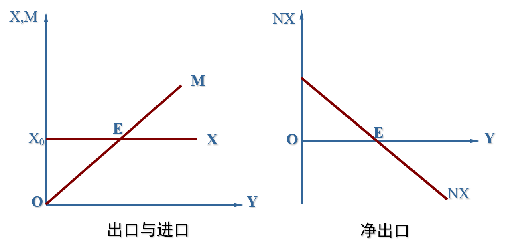
  

--- 
### **六、国民收入决定与变动**  
#### 1、两部门经济产出与变动 
* **两部门经济产出决定**  

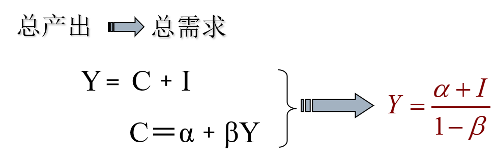
  

* **消费乘数**  

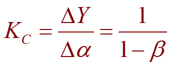
  

   

>消费乘数的作用是**双向**的  
>消费乘数＞1，是因为**引致支出**的存在  

#### 2、三部门经济产出决定与变动  
* **政府购买乘数**  

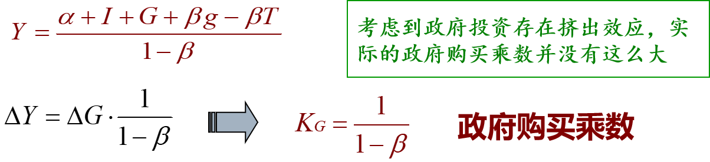

* **转移支付乘数**  

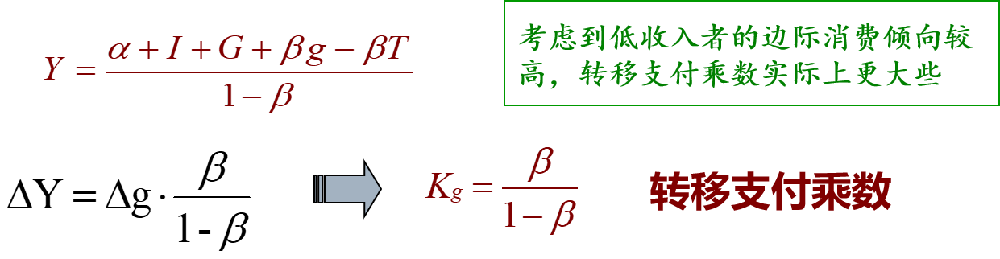

* **税收乘数**  

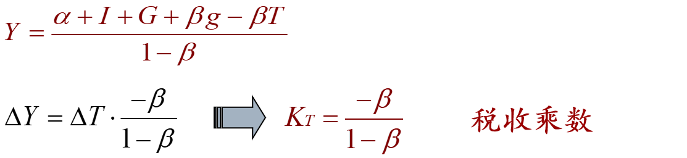

* **平衡预算乘数**  

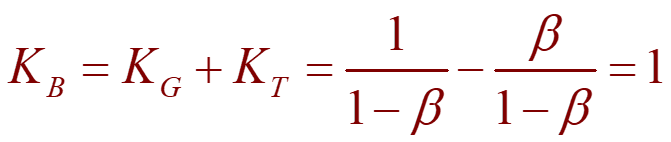
  

* **考虑比例税后**  

#### 3、四部门经济产出决定与变动  
* **四部门经济产出决定**  

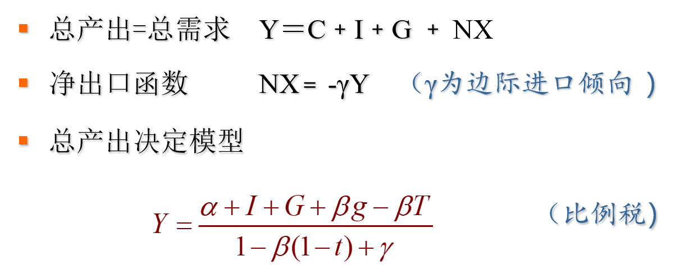

---
---
## **第四章 产品市场货币市场共同均衡**  
---
### **一、IS曲线：产品市场均衡**  
#### 1、IS曲线的推导  
* 产品市场均衡的**三个方程**：  

<strong>均衡条件：I=S</strong>

<strong>投资函数：I﹦e-dr</strong>

<strong>储蓄函数：S=-α+(1-β)Y  
</strong>

* 如果**消费函数**和**投资函数**已知，可以求出IS曲线的方程  

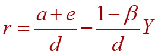

* 如果IS曲线方程已知，可以推算出**不同利率下实现产品市场均衡时的产出水平Y**，或**不同产出水平下实现产品市场均衡时的利率水平r** 

<strong>Y=C+I+G+NX</strong>
  

#### 2、IS曲线的含义  
* 利率高时总产出水平少，利率低时总产出水平高  

利率高->投资机会少->投资规模小->产出水平低
  

* IS曲线上的点都表示**I=S**，即**产品市场实现均衡**  

<strong>总供给（总产出 S）=总需求（总支出 I）</strong>
 

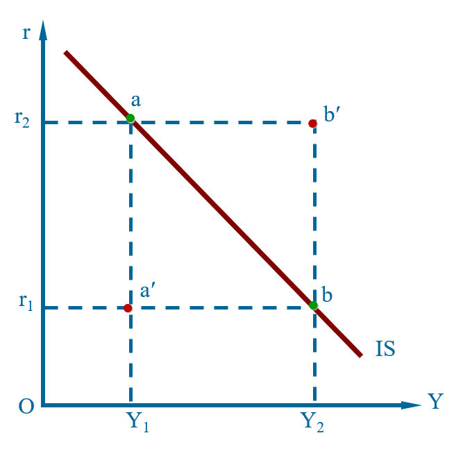
  

* 结论：  
左下方：需求>产出  
右上方：需求<产出

#### 3、IS曲线的斜率  
* IS曲线的斜率取决于**边际消费倾向β**和**投资利率系数d**  
1、β越大，IS曲线的斜率越小，产出对利率变动的反应越敏感（原因：β越大，s越小，一定的利率变动引起的投资变动，需要产出较大的变动进而引起储蓄的较多变动，以保持I=S)   
2、d越大，IS曲线的斜率越小，产出对利率变动的反应越敏感（原因：d越大，投资对利率变化越敏感，利率的较小变动会引起投资的较大变动，需要产出和储蓄较大的变动，以保持I=S） 
* 在其他条件不变的情况下，**自发支出**（自发消费、自发投资、政府购买、出口）增加使IS曲线向右方移动，表示**既定的利率与更高的产出水平结合**才能实现产品市场的均衡  
---
### **二、 LM曲线：货币市场均衡**  
#### 1、货币需求
>交易型货币需求  
>预防性货币需求  
>>用**L1**表示交易型货币需求和预防性货币需求  
>>
<strong>L1=kY</strong>
  
>投资性货币需求  
>>用**L2**表示交易型货币需求和预防性货币需求  
>>
<strong>L2=-hr</strong>
 
>>
> 
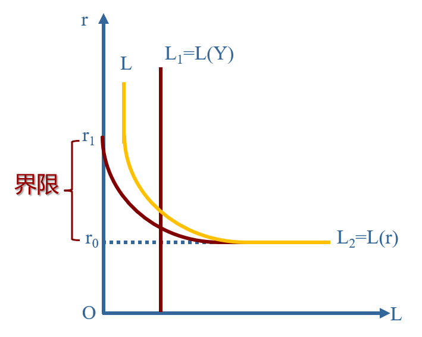

#### 2、LM曲线的推导  
* 货币市场均衡的**三个方程**：  

<strong>均衡条件：L=m</strong>

<strong>货币需求：L=kY-hr</strong>

<strong>货币供给：m=M</strong>

* 产品市场均衡时利率r与产出Y的匹配关系 

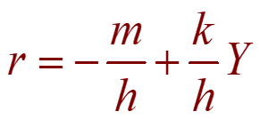

#### 3、LM曲线的含义  
* **L为货币需求，M为货币供给**
* 货币供应量M一定，产量较高→用于交易的货币较多→投机性货币需求较少→保持货币市场均衡的利率水平较高  
* LM曲线上的点都表示**L=M**，即**货币市场实现均衡**  

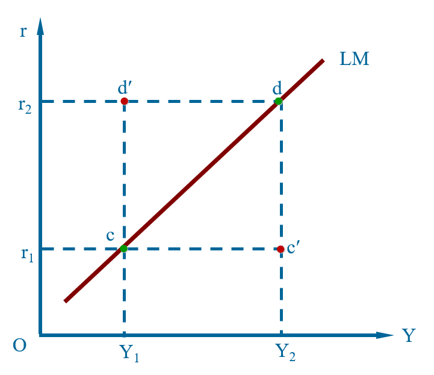
  

* 结论：  
右下方：货币需求大于货币供给  
左上方：货币供给大于货币需求  

#### 4、LM曲线的斜率  
* LM曲线的斜率取决于**交易性和预防性货币需求系数k**和**投机性货币需求系数h**  
1、k越大，LM曲线斜率越大，产出对利率变动反应越迟钝（原因：当利率发生上升时，因h固定的，所以投机性货币需求的减少是一样的，在货币供给不变的情况下，需要交易性货币需求的增加来弥补，k越大，小量产出增加就可以弥补，k越小，需要更多产量增加才能弥补）   
2、h越大，LM曲线斜率越小，产出对利率变动反应越敏感（原因：h大，一定的利率变动会引起投机性货币需求较大的变动，从而导致可用于交易的货币供给—由产出决定—较大的变动
* 交易性货币需求增加，会使LM曲线发生右移  
* 投机性货币需求增加，会使LM曲线发生左移  
* 货币供给增加，会使LM曲线发生右移
---
### **三、IS-LM模型：两个市场同时均衡**  
* 当IS曲线和LM曲线的方程已知，则可以求解该社会的**均衡利率水平r**和**产出水平Y**  
* 政策含义:政府可以通过**财政政策**和**货币政策**来调控宏观经济的运行
   >IS曲线和LM曲线的移动会改变产品市场和货币市场同时均衡的状况，而IS曲线可以通过政府的财政政策（主要是政府购买，还包括转移支付和税收）改变其位置，LM曲线可以通过政府的货币政策（货币供给）改变其位置  

---
---
## **第五章 总供给-总需求分析**  
---  
### **一、总需求与AD曲线**  
#### 1、AD函数的导出  
* **总需求**：一定时期社会各部分计划购买的产品总量  
  取决于**产出水平C、财政政策G、货币政策I、价格水平P**等因素  
* **总需求函数**：产品市场（IS）与货币市场（LM）平衡时，**总需求Y与价格水平P**之间的关系  
* **导出：**  

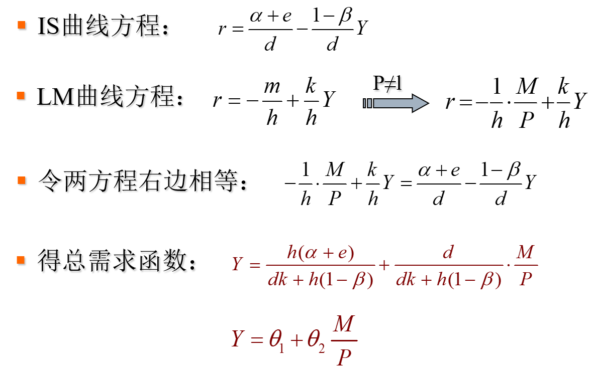

* AD曲线表明产品市场和货币市场同时处于均衡状态时，产出水平Y与价格水平P呈**反方向**变动关系  

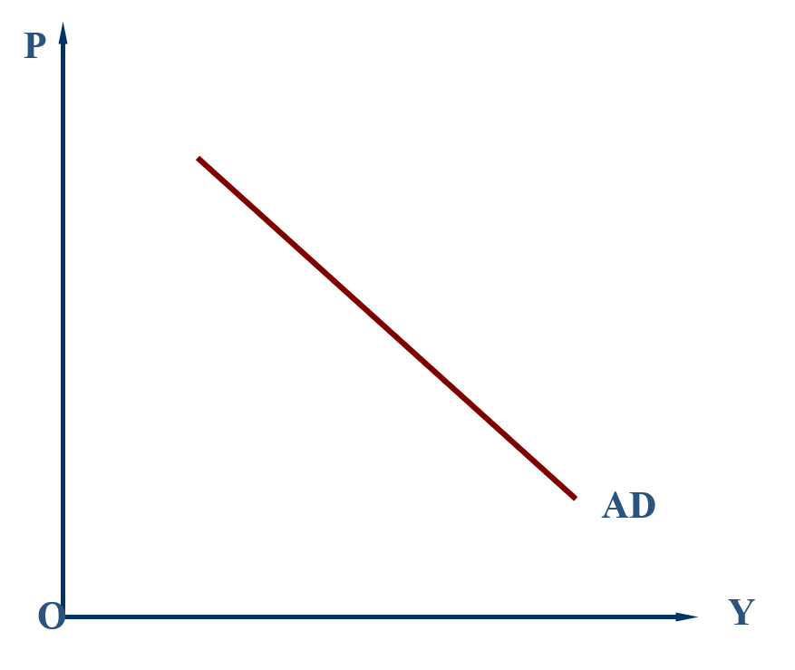
  

#### 2、AD曲线的意义  
* 在名义货币供给量不变，产品市场和货币市场均衡的时候，Y与P之间存在关系：
   > 价格下降->**实际货币供给增加**->货币市场供大于求->为维持货币市场均衡，需增加货币需求量->增加投机性货币需求->利率必须降低->**利率降低**->投资增加->产品市场投资大于储蓄->为使产品市场均衡，需要储蓄增加->**产出必须增加**

#### 3、AD曲线的斜率  
* AD曲线的斜率反应：**产出对价格变动的反应的敏感程度**  

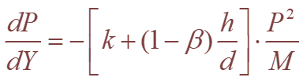
  

* k、β、M在短期内难以改变，斜率的主要决定因素是h和d
  >h来源于**投机性货币需求**：L2=-hr  
  >d来源于**投资函数**：I=e-dr  

* 引起AD曲线移动的因素  
  >**消费需求变动**（个人所得税，福利政策、城市化水平）  
  >**投资需求变动**(企业税收，对市场前景的预期)   
  >**政府购买变动**（调节宏观经济） 
  >**预期变化**（收入、利润率、通货膨胀）   
  >**世界经济形势变化**（汇率、外国收入）  
  >**货币供给变动**（通过利率影响投资，消费、出口）  

---

### **二、总供给与AS曲线**  
#### 1、AS曲线的推导  
* **总供给**：一定时期内整个社会的总产量  
* 反应**总产量Y**与**价格水平P**之间的关系，利用**劳动市场的供给曲线和需求曲线**推出  
* 根据货币工资是否具有伸缩性，AS曲线分为长期和短期两种  
   >**短期AS曲线**：（凯恩斯货币工资下降刚性假设）货币工资只能上升不能下降  
   >**长期AS曲线**：（古典AS曲线）  
  
#### 2、 AS曲线的含义  
* 价格水平影响实际工资，进而影响**劳动市场的供求关系**及就业量，最终影响总产量  

---  
### **三、总需求与总供给均衡**  
* 有效需求决定模型、IS-LM模型、 AD-AS模型的区别与内在逻辑关系  
>*  三个模型都说明总产出的决定，且其推导都用到了I=S（总供给=总需求）这个条件。  
>*  有效需求决定模型只反映**产品市场的均衡**，没有考虑利率水平和物价水平；IS-LM模型反映了产品市场和货币市场的均衡，考虑了利率水平但没考虑物价水平；AD-AS模型反映了产品市场、货币市场和劳动市场的均衡，并且同时考虑了利率水平和物价水平。  
>* 有效需求决定模型和IS-LM模型只是从**需求方面**考虑产出的决定（产出自动等于需求），而AD-AS模型同时从**需求和供给**两个方面考察产出的决定。
  
---
---
## **第六章 宏观经济政策**  
---  
### **一、宏观经济政策目的**  
#### 1、政策目标体系  
* **充分就业**：劳动力充分就业，只剩下自然失业率  
* **物价稳定**：价格指数的相对稳定  
* **经济增长**：实际GDP的年增长率  
* **国际收支平衡**：既无国际收支盈余也无国际收支赤字  

#### 2、政策目标选择  
* **政策目标之间的一致性**  
   1.经济稳定增长，就业率高，物价稳定->国际收支平衡  
   2.物价稳定、国际收支平衡是经济增长、充分就业的前提条件  
* **政策目标之间的冲突**  
   目的|变化|结果|矛盾点  
   --|:--|:--|:--  
   实现充分就业|运用扩张性财政政策|财政赤字和通货膨胀|**充分就业与物价稳定**  
   经济增长|对生产要素需求增长|物价水平上升|**经济增长与物价稳定**  
   经济增长|收入增加引起进口增加，边际进口倾向有提高趋势|国际收支失衡|**经济增长与国际收支平衡**  
---  
### **二、财政政策**  
#### 1、财政政策的工具  
* **财政收入**  
  * **税收**：国家按照法律规定的标准，强制、无偿地从个人和企业取得财政收入的一种手段  
     分类|名称  
     --|:--  
     按课税对象分|流转税（增值税、营业税、消费税）  
     &emsp;|所得税（个人所得税、企业所得税）  
     &emsp;|财产税（房产税、土地增值税、遗产税）  
     &emsp;|行为税、资源税  
     按税负是否转嫁|直接税（所得税、财产税）  
     &emsp;|间接税（流转税）  
     按税率|比例税、累进税、类退税
     * **社会保障金**可以看作一种**特殊的税**  
     * 政府可以通过改变税率或变动税种来影响经济活动：减税会引起总需求和总产出的增长  

  * **公债**：政府运用国家信用向公众借钱筹集财政资金时形成的**债务**，可以进入**市场**流通  
    * 公债种类：短期债券、中期债券、长期债券  
    * 目的：
      1. **财政政策**：增加财政收入，影响财政收支规模  
      2. **货币政策工具**：通过其在市场上的流通来调节货币供求  

* **财政支出**  
  * **政府购买**：政府对商品和劳务的购买  
    * **政府消费**  
    * **政府投资**  
    * 政府购买是实质性支出，直接形成**社会需求**，调节**社会总需求增减**  

  * **转移支付**：政府无偿支付给个人的资金  
    * 包括社会保障福利支出、政府公债利息、政府对农业的补贴  
    * 是**货币性支出**，但会影响公众的可支配收入与消费支出，也是重要的**财政政策工具**  

* 财政政策的作用机理  
  * **政府购买↑** → 总投资↑ → **经济扩张**  
  * **政府转移支付↑** → 消费↑ → 总需求↑ → **经济扩张**  
  * **税收↑** → 投资和消费↓ → 总需求↓ → **经济收缩**  
  * **公债↑** → 政府投资↑ → 总需求上 → **经济扩张**  
  
#### 2、自动稳定器  
* **财政制度**具有自动稳定器的功能  
* 经济系统本身所具有的能够减少各种干扰因素对宏观经济冲击的机制  
* **作用机理**：  
  1.**税收自动变化**  
  2.**转移支付自动变化**  
  3.自动稳定器功能的大小取决于：  
  * **税收的起征水平和税率的累进幅度**  
  * **转移支付的结构**（社会保障福利支出在转移支付中的比重）  

#### 3、相机抉择的财政政策
* 政府未达到预定的产出水平而采取的变动政府收入和支出的政策  
* 使用原则：**逆经济风向行事**  
  >**扩张性财政政策**：减税、增加政府支出  
  >**紧缩性财政政策**：增税、减少政府支出

#### 4、财政政策的调控效应  
* **产出效应**：财政政策引起的**产出水平**变化  
* **挤出效应**：政府支出增加→利率水平上升→抑制部分投资  
  >如何计算由投资改变产生的**挤出效应与产出效应**  

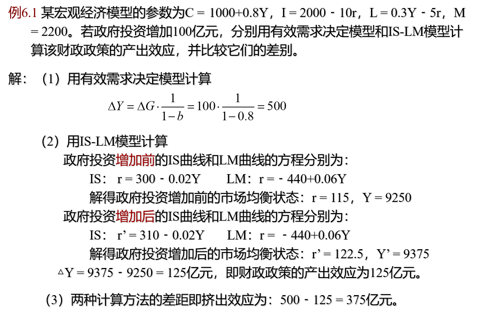
 

<strong>有效需求决定模型</strong>所算出的产出效应-<strong>IS-LM模型</strong>算出的产出效应=挤出效应
  

* **IS-LM曲线的斜率**对财政政策的影响  
  * **IS曲线**斜率越大，产出效应越大，挤出效应越小  
    * IS斜率为<strong>（1-β）/d</strong>  
    * β：边际消费倾向  
    * d：投资利率系数  
  * **LM曲线**斜率越大，产出效应越小，挤出效应越大  
    * LM斜率为<strong>k/h</strong>  
    * k：交易型货币需求系数  
    * h：投机性货币需求的利率影响系数  

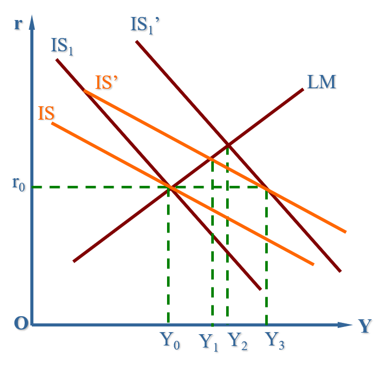

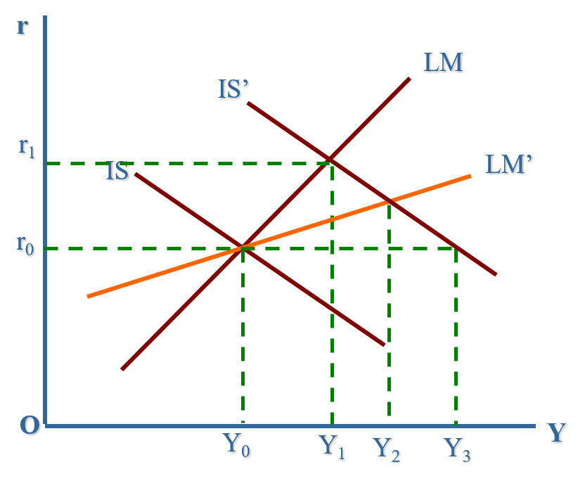
  

>* **决定财政支出挤出效应大小的因素**  
>* **货币需求对产出变动的敏感程度**，即L=kY-hr中k的大小。k越大，政府支出增加引起的一定量产出增加导致的交易性货币需求的增加也越多，因而使利率上升越多，挤出效应越大。 
>* **货币需求对利率变动的敏感程度**，即货币需求函数L=kY-hr中h的大小。h越小，一定量的交易性货币需求变动会引起利率的较大幅度变动。因此，当政府支出增加引起交易性货币需求增加时，利率上升较多，挤出效应越大。 
>* **投资对利率变动的敏感程度**，即投资函数I=e-dr中d的大小。d越大，一定的利率变动对投资的影响越大。因此，当政府支出增加引起货币需求增加进而导致利率上升时，挤出效应就越大。 

---  
### **三、货币政策**  
#### 1、货币政策的工具  
* 货币政策通过**利率的变动**对总需求发生影响  
* **分类**：  
  **平衡的货币政策**：保持货币供给和利率水平稳定  
  **扩张性货币政策**：***经济萧条时***，增加货币供给量，降低利率，扩大需求，刺激经济增长  
  **紧缩性货币政策**：***通货膨胀时***，减少货币供给量，提高利率，缩小需求，一直经济增长  
* **政策工具**：逆经济风向行事 
  * **公开市场业务**：中央银行在金融市场上公开买卖有价证券，以调节货币供应量和利息率的一种政策手段  
    **优点**：时间灵活，见效快，数量可控，期限可选，操作可逆  
    >买进有价证券→货币投入市场→商业银行存款增加→贷款增加→货币供应量成倍增加→利息率下降→投资增加→总需求扩大→总产出增加
  * **调整再贴现率**：当商业银行资金不足时，可以用***客户已贴现但尚未到期的商业票据***到中央银行要求再贴现，再贴现率是商业银行向中央银行进行再贴现时的利率  
    >降低再贴现率→商业银行向中央银行增加借款→商业银行扩大放款→货币供应量增加→利息率下降→投资增加→总需求扩大→总产出增加 
  * **改变存款准备率**：存款准备金率是商业银行吸收的存款中用作准备金的比率，中央银行可以变动准备金率来调节**货币供给量**  
    >降低存款准备金率→货币供应量增加→利息率下降→投资增加→总需求扩大→总产出增加
* **辅助性货币政策工具**：
  1. **消费信贷控制**（规定应支付现款的最低限额和付清全部贷款的最长期限）
  2. **抵押贷款控制**（规定抵押条件，用于房地产购买）
  3. **窗口指导**（根据物价变动趋势和金融市场状况，规定商业银行每季度贷款的增减额度，并要求执行）
  4. **道义劝告**（对商业银行及其他金融机构的贷款、投资业务进行口头或书面劝告，影响其贷款和投资方向）

#### 2、基础货币与货币创造  
* **基础货币**：构成市场货币供给的基础，包括**存款准备金率**和**居民手持现金**  
* 基础货币由**中央银行**投放：  
  1、购买黄金、外汇   
  2、在金融市场进行公开市场业务操作  
  3、直接发行通货
* **货币乘数**：

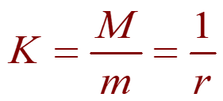

<strong>货币供给量M=基础货币m×货币乘数r</strong>
  

#### 3、货币政策的调控效应  
* **IS曲线斜率对货币政策的影响**：IS斜率越大，货币政策产出效应越小  
  * β与货币供求没有直接关系。决定IS曲线斜率的因素是**投资利率系数d**  
  * **𝐼=𝑒−𝑑𝑟**  
* **LM曲线斜率对货币政策的影响**：LM斜率越大，货币政策产出越大  
  * **L=kY﹣hr**  
  * 改变投机性货币需求对利率变动的敏感程度h    
---  
### **四、财政政策与货币政策的运用**  
#### 1、调控政策的选用  

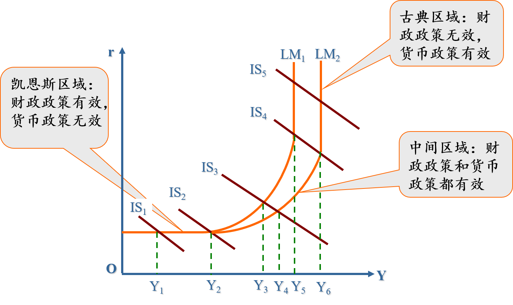
  

#### 2、调控政策的组合

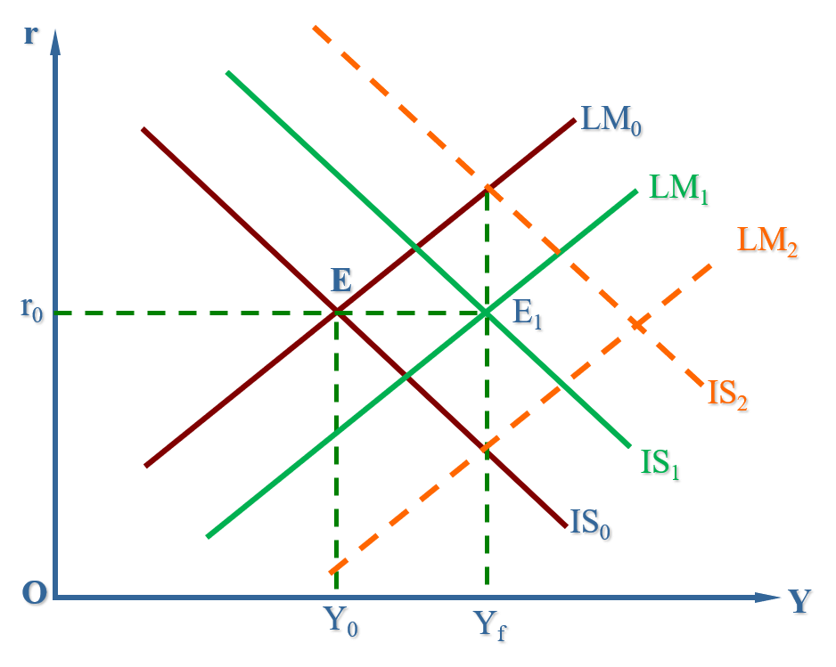
 

序号|财政政策|货币政策|产出|利率|使用情景  
--|:--:|:-:|:-:|:-:|:-:|:-:  
1|扩张性|扩张性|增大|不确定|严重萧条  
2|扩张性|紧缩性|不确定|上升|滞胀  
3|紧缩性|扩张性|不确定|下降|轻度通胀  
4|紧缩性|紧缩性|缩小|不确定|严重通胀  

#### 3、政策调控的力度  
名称|特点|优点|缺点  
--|--|--|--
**微调**/**软着陆**|调控力度小，调控时间长|副作用小|时间长  
**骤调**/**硬着陆**|调控力度大，调控时间长|时间少|副作用大  

#### 4、政策出台的时机  
* **政策时滞**：某项政策从制定到对经济产生实质性影响的时间
  * **内时滞**
    * **认识时滞**   
    * **决定时滞**
    * **批准时滞**
  * **外时滞**
    * **传递时滞**  
    * **执行时滞**  
    * **作用时滞**  

---  
### **五、供给管理政策**  
#### 1、人力政策
  * 通过对人力资源的优化配置，增加就业，促进经济增长的政策  
    * 人力资本投资
    * 完善劳动力市场 
    * 协助劳动力流动
    * 降低最低工资标准

#### 2、收入控制制度  
  * 政府通过某种行政措施强制性或非强制性地**限制工资和价格**的政策，又称为工资与物价控制政策，目的是**制止工资成本推动的通货膨胀**  
    * 工资-物价指导  
    * 工资-物价冻结（法令禁止厂商提高工资和物价）  

#### 3、收入指数化政策  
  * 按**通货膨胀率**来调整有关名义变量，使其实际值保持不变
    * 工资指数化  
    * 税收指数化  
    * 利率指数化  
---
---
## **第七章 失业、通货膨胀和经济周期**  
---
### **一、失业的定义**  
#### 1、失业的定义及衡量  

 

* **衡量失业/就业状况的指标**  

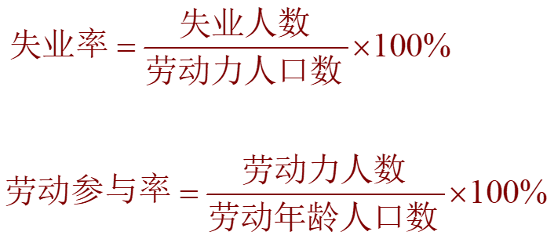
 

#### 2、失业的分类  
* **自愿失业**  
* **摩擦性失业**：就业状态暂时中断  
  * **周转性失业**  
    * 原因：劳动力市场信息不完全    
  * **结构性失业**  
    * 职业不匹配  
    * 地区不匹配
  * **季节性失业**：生产经营具有季节性
* **非自愿失业（需求不足的失业）**：有劳动能力且接受先行工资水平与工作条件，但仍找不到工作  

#### 3、充分就业和自然失业率  
* **充分就业**：一个经济体中不存在**非自愿失业**  
* **自然失业率**：充分就业下的失业率  
* **潜在GDP/潜在产能**：现有条件下，一个经济体在充分就业的情况下所能生产的GDP  

---  
### **二、失业的原因及影响**  
#### 1、失业的原因解释  
* **新古典经济学**：以“伊萨定律”为核心  
  >如果社会存在失业，也只是自愿失业和摩擦性失业，只是生产过程中**局部的、暂时的失调**  
* **凯恩斯**：提出“非自愿失业”理论
  >**有效需求**不足时，充分就业无法实现  
  
  **有效需求不足**的原因：
  * **边际消费倾向递减**： 
    * 收入增加->边际消费倾向递减  
    * 若消费减少的同时**投资相应扩大**，可避免有效需求不足
  * **资本边际效率递减**：
    * 投资边际效率递减->投资不足  
    * 只要**利率不断下降**，投资规模可能增加
  * **流动性偏好**  
    * 流动性陷阱的存在，使**利率不可能无限降低**  
    * 当**投资边际效率接近利率**，厂商不愿意投资  

 

* **新凯恩斯**：以**不完全竞争和不完全信息**为前提，论证**工资黏性**进而解释**非自愿失业**存在的原因 
  * **劳动工资合同论**：通常工资会增长而不会降低  
  * **隐含合同论**：工资相对固定，不随经济波动调整  
  * **“局内人-局外人”理论**：对新老员工支付相同工资  
  * **效率工资理论**：支付比劳动力市场出清时更高的工资，以促使劳动生产力的提高  

* **现代货币主义**：“自然失业率”假说（在没有货币因素干扰的情况下，劳动力市场和商品市场的自发供求力量发挥作用时应有的、处于均衡状态下的失业率）  

#### 2、失业的影响和奥肯定律  
* **失业的影响** 
  * 给个人和家庭带来物质和精神的负面影响  
  * 影响社会稳定  
  * 影响经济发展 
    * 增加经济运行成本 
    * 带来产出损失  
    * 影响整个社会的信心  

* **奥肯定律**：在经济周期中，**失业和产出存在反向变动关系**  
  
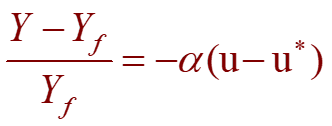
   

  **实际GDP必须保持与潜在GDP同样的增长速度**，才能避免失业率上升  

---
### **三、通货膨胀的定义和分类**  
#### 1、通货膨胀的定义  
* **通货膨胀**：经济体在一定时期内价格水平**普遍**而**持续**地上升到**一定程度**  
* **通货紧缩**
* **物价稳定**  

#### 2、通货膨胀的衡量  
* **GDP平减指数**：名义GDP和实际GDP的比率（只包括国内生产）  
  

 

* **消费价格指数CPI**:一定时期里城乡居民消费的物品和劳务(包括进口品）的**价格平均变化程度**的指标  
  
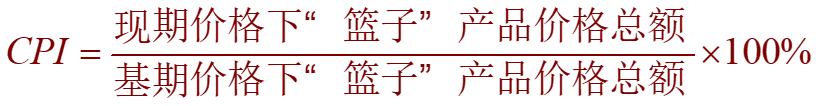
 

* **通货膨胀的类型**  
  * 按**价格上升程度**分：温和的、奔腾的、恶性的  
  * 按**人们的预料程度**分：预期的、未预期的  
  * 按**商品价格变动差别**分：平衡的（各商品价格上升同幅度）、非平衡的  
  * 按**表现形式**分：公开性的、隐蔽性的、抑制性的
---  
### **四、通货膨胀的原因**  
#### 1、需求拉上型通货膨胀  
* **总需求大于总供给**引起  
* 原因：财政政策、货币政策、国际市场的需求变动  

#### 2、成本推动型通货膨胀  
* **供给方面生产成本提高**引起  
* 类型  
  * **工资推动型**：不完全竞争的劳动市场造成的过高工资  
  * **利润推动型**：垄断企业和寡头企业 
  * **进口型**：重要的进口物资价格上升  
  * **出口型**：因出口迅速扩张，导致出口产品的生产部门的边际生产成本上升  

#### 3、结构型通货膨胀  
* **需求转移型通货膨胀**：需求结构变化，而生产要素却不能及时转移。需求增加部门的产品价格上涨，而需求减少部门的产品价格没有相应下降  
* **生产率差异型通货膨胀**：劳动生产率提高慢的部门要求工资增长向劳动生产率提高快的部门看齐，从而引起通货膨胀  

#### 4、货币主义的解释  
* 结论：通货膨胀是货币供给增加的结果

---
### **五、通货膨胀的效应**  
#### 1、通货膨胀的惯性
* 通货膨胀的发展过程通常是**螺旋式的上升运动**  

#### 2、通货膨胀的后果  
* **社会成本**  
  * **增加“鞋底成本”**— 增加了消费者持有货币的成本  
  * **增加“菜单成本”**— 增加厂商调整价格的成本  
  * **造成了价格体系中的“噪声”**— 掩盖了产品价格所传递的市场供求信息的真实性，从而降低了整个市场体系的效率  
* **经济影响**  
  * **对收入分配的影响**  
    * 不利于靠固定收入维持生活的阶层  
    * 有利于债务人不利于债权人  
    * 有利于政府不利于公众  
  * **对财产的影响**  
    * 资产  
      * 价格大体随通胀变动（房地产，股票）  
      * 本息金额固定（现金，存款，债券）  
    * 债务：各类贷款、借款（本息金额固定）  
   * **财产净值=资产价值-债务价值**  
   * **对产出的影响** 
     * 增加生产和就业  
       * 未预期：生产者获利从而**增产**  
       * 预期：无影响  
     * 前提：  
       * 需求拉动的通货膨胀  
       * 温和的  
       * 社会有闲置资源 

#### 3、菲利普斯曲线  
* 形式  
  * **失业-工资线**  
  
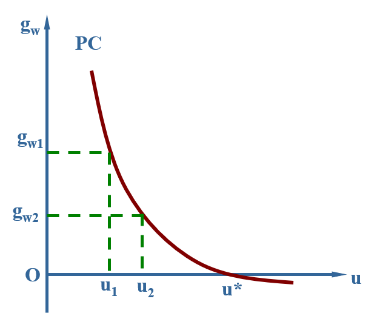

  
  * **失业-物价线**
  
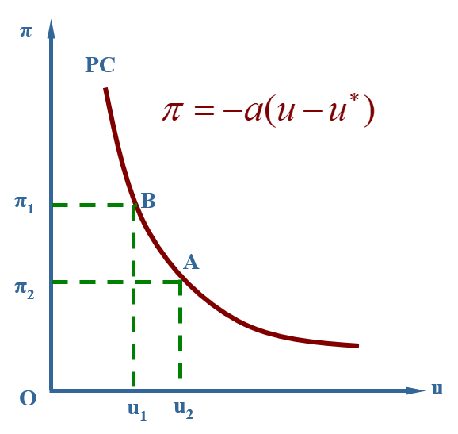
  

* **政策含义**：用高通胀率换低失业率，用高失业率换低通胀率  
* **附加预期的菲利普斯曲线**  
  
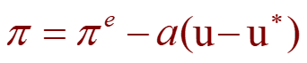
  

* **长期菲利普斯曲线**  
长期菲利普斯曲线是一条**直线**  
且长期中，经济社会能实现充分就业，失业率处于自然失业率的水平  

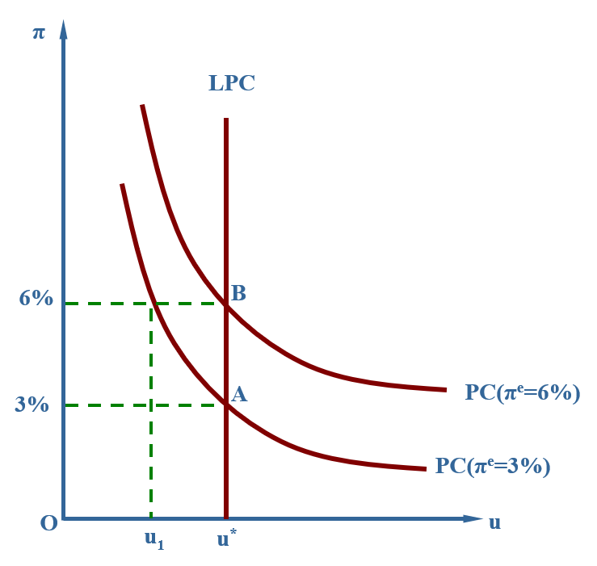
  

#### 4、通货紧缩与停滞膨胀  
* **通货紧缩不利影响**：  
  * 对**GDP增长**产生影响 
  * 对**就业**产生影响  
  * **资产价格大幅度下跌**  
* **停滞膨胀**/**滞胀**：生产停滞+物价上涨  
  原因：  
  * **菲利普斯曲线整体向右移动**  
    * **实际因素的变动**：劳动力数量增大、科技进步等  
    * **预期因素的变动**  
  * **供给冲击**使总供给曲线发生移动  

---
### **六、经济周期概述**  
#### 1、经济周期概述  
* 含义
1. 使现代社会**不可避免**的经济波动  
2. 是**总体经济活动**所发生的波动  
3. 一个经济周期由**繁荣、衰退、萧条、复苏**四个阶段组成  
4. 每个周期的长短和表现形式不完全相同    

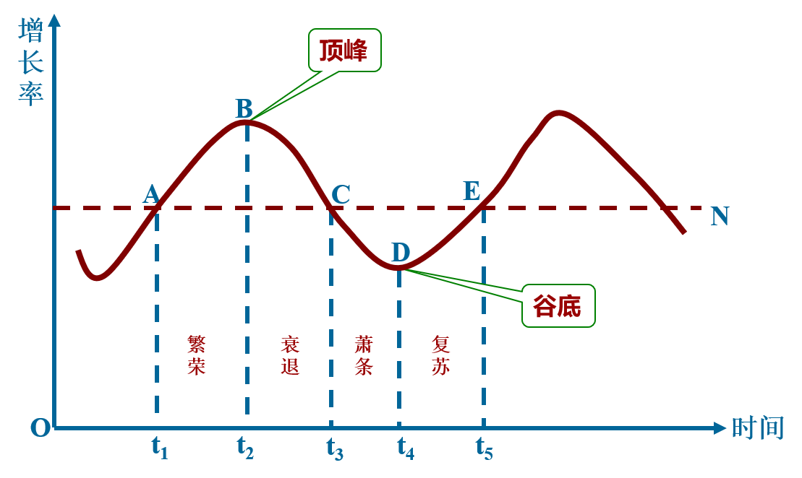
  

* **短期经济走势的衡量——采购经理指数PMI**  
PMI以百分比表示，以50%作为经济走势的分界点  
当PMI高于50%时，为**经济扩张**的讯号  
当PMI低于50%，则反映经济衰退  
接近40%时，则有**经济萧条**的忧虑  

#### 2、经济周期的类型  
类型名称|时长分类|平均长度|相关  
:--:|:--:|:--:|:--:
基钦周期|短周期|一个主周期包括2-3个次周期(平均长度约为40个月)|存货投资波动   
朱格拉周期|中周期|平均长度8-10年|固定资产投资波动   
库兹涅茨周期|中长周期|平均长度20年|建筑业兴衰
康德拉季耶夫周期|长周期|平均长约50年|基本资本货物投资波动
熊彼特周期|短、中、长三种周期|每个长周期包括6个中周期，每个中周期包括3个短周期，短周期约为40个月|重大创新 

---
### **七、经济周期理论**  
#### 1、早期经济周期理论  
* **消费不足理论**：**国民收入分配不平**等所造成的穷人购买力不足和富人储蓄过度   
* **投资过度理论**：过度投资导致的**资本品生产的过度增长**引起消费品生产的减少，从而造成经济结构的失衡  
* **货币信用过度论**：经济周期是由于**银行体系**交替地扩大和紧缩信用造成的  
* **创新理论**：创新提高了生产效率，引起其他企业仿效，形成创新浪潮。**创新浪潮使银行信用扩大，对资本品的需求增加，引起经济繁荣**。随着创新普及，盈利机会消失，银行信用紧缩，对资本品的需求减少，这就引起经济衰退。直至另一次创新出现，经济才再次繁荣。
* **心理预期理论**：预期对人们的经济行为有决定性影响，**乐观的预期与悲观的预期交替**引起了经济周期中繁荣与萧条的交替  
* **太阳黑子理论**：太阳黑子的活动对农业生产影响很大，而农业生产的状况又会影响工业及整个经济  
* **政治周期理论**  

#### 2、乘数-加速数模型  
* 乘数原理说明**投资变动对产出变动的影响**，倍数为**1/（1-β）**  
* **产出变动**也会影响**投资**

  

* **乘数-加速数模型**：说明消费、投资、产出间关系

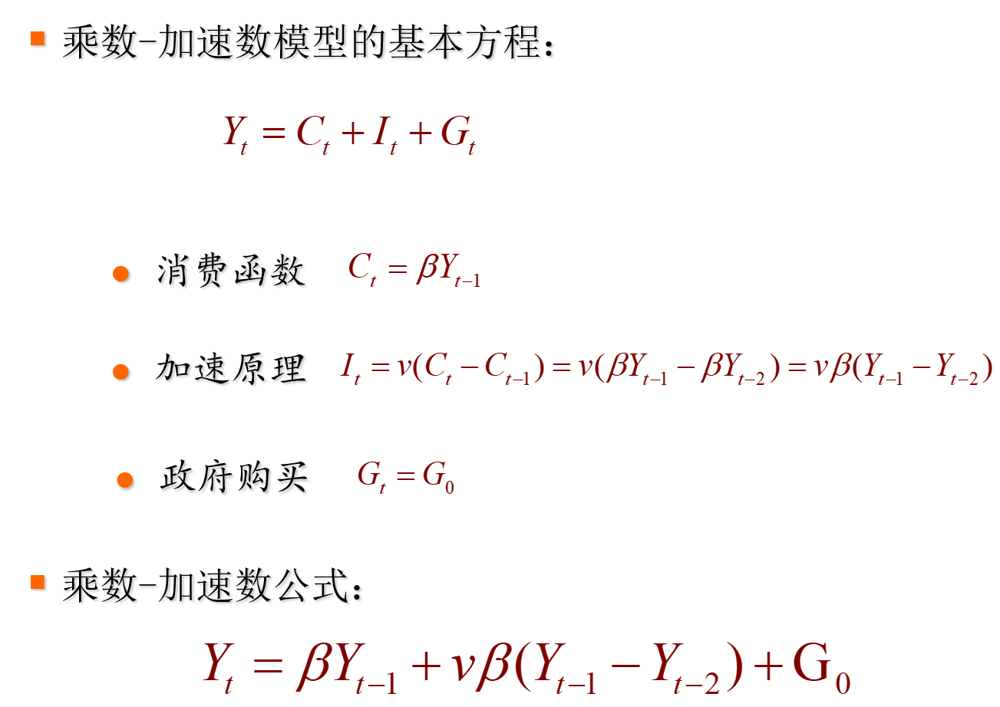
  

* **含义**  
1. 乘数与加速数相互作用**强化了经济波动的趋势**  
2. 经济波动的幅度取决于**边际消费倾向和加速数的大小**，如果这两个参数较小，则经济的波动幅度较小
3. 政府可以通过**经济干预政策**来缓解经济周期的波动  

#### 3、实际经济周期理论  

---
---
## **第八章 经济增长**  
---
### **一、经济增长概述**  
#### 1、经济增长的含义  
* 集中体现是**产品生产能力/GDP**的不断增加  
* **技术进步**是必要条件  
* **制度与思想意识的调整**是重要前提 

#### 2、经济增长的重要性  
* **提高国民福利的基本前提**  
* **实现充分就业的基本途径**  
* **保持物价稳定的重要途径**  

#### 3、经济增长的一些事实  
* 世界范围内国家地区间生活水平差距较大  
* 国家间收入增长率差距较大  
* 国家或地区的**投资率与人均收入正相关**  
* 国家地区的**人口增长率与人均收入负相关**  

#### 4、经济增长的研究视角  
* **经济增长模型**  
* **经济增长核算**

#### 5、TFP：全要素生产率
* 要经济增长，TFP对于经济增长的贡献率应当增大  
* 然而，第三产业的增长会降低TFP贡献率  

#### 6、索罗余值：技术进步对经济增长的贡献

---
### **二、新古典增长模型**  
#### 1、基本假定  
* 社会只生产/消费/投资**一种产品**  
* 储蓄函数为**S=sY**，全部储蓄都转化为投资  
* **资本的折旧率为δ**  
* 生产的规模报酬不变  
* 劳动力按**不变的比率n**增长  
* **技术进步率**为不变的常数g  
* 生产中**劳动-资本**的比率（技术系数）可变  

#### 2、基本方程  

  

* **人均产量Y/N取决于人均资本量K/N**  

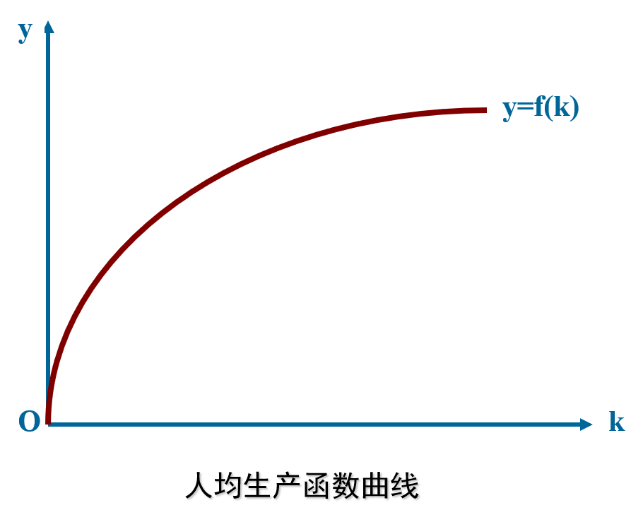
  

* **人均资本变化=人均储蓄（投资）-持平投资**  
* **资本深化=人均储蓄（投资）-资本广化**  

#### 3、稳定状态分析  
* **人均资本k**达到均衡值并保持不变，**人均产量y**也达到稳定状态  
* 条件：**sf（k）=（n+δ）k**

#### 4、新古典增长模型的运用  
* **储蓄率s**对稳态的影响  
  
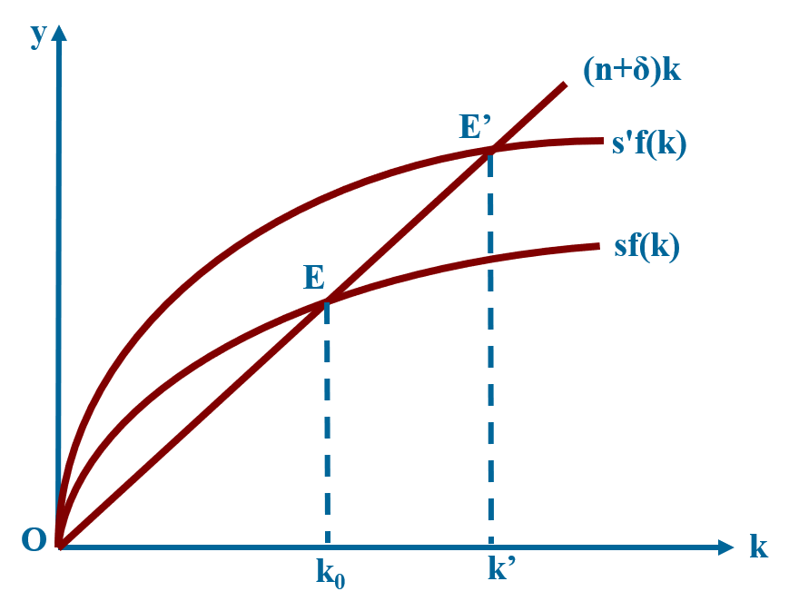
  

  * **较高的储蓄率意味着较高的稳定状态**   
  * **较高的储蓄率导致的较快增长是暂时的**，无法保持增长  
* **人口n**对稳态的影响  
  
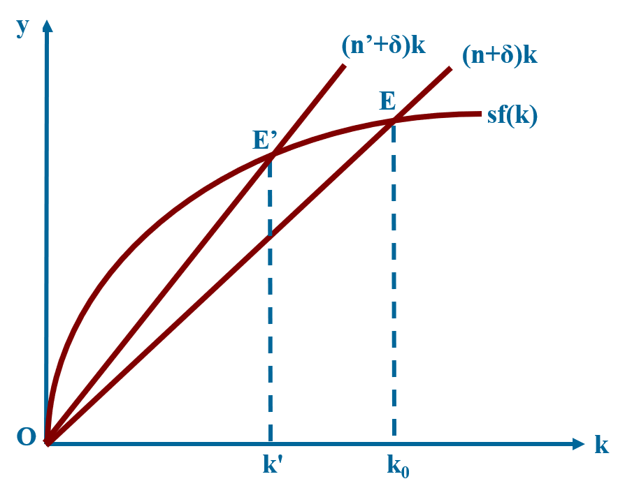
  
  
  * **人口增长率的提高会降低人均资本的稳定状态，进而降低人均产量的稳定状态**  

* **资本积累的黄金率**：若要使稳定状态的**人均消费最大**，稳定状态的人均资本量应使**人均产量函数的一阶导数等于人口增长率加折旧率**  
   
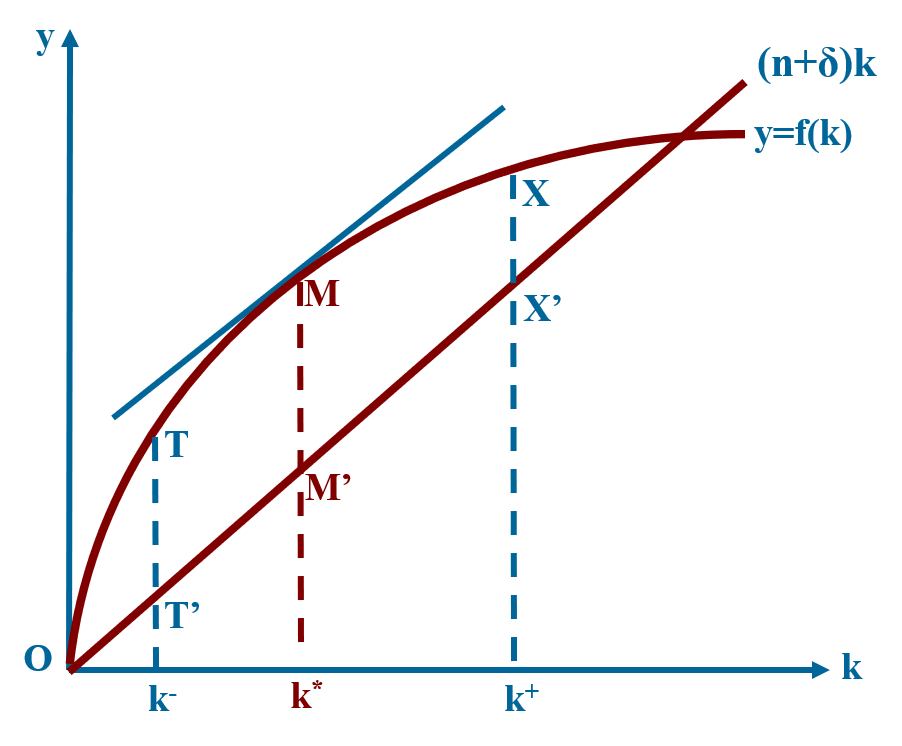
   

#### 5、技术进步下的增长  
* **基本方程**  
 
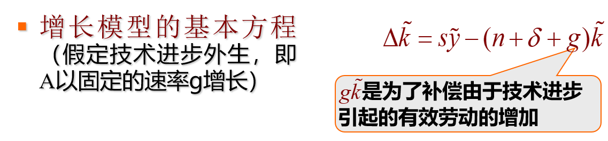
  

---
### **三、内生增长模型**    
 
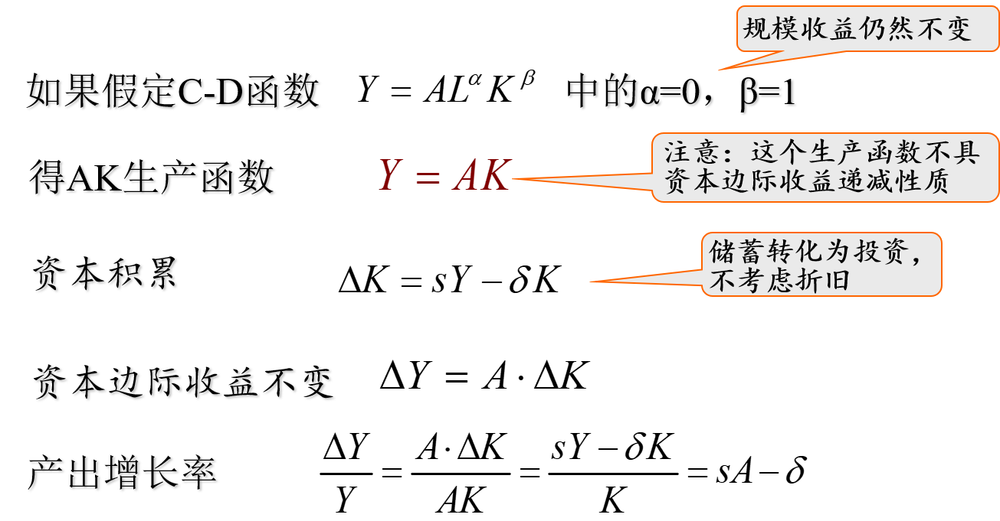
  

* **折旧率**一定时，产出增长率取决于**储蓄率A**和**技术水平s**
---
### **四、经验运用**  
#### 1、增长核算方程  

<strong>产出增长率=(劳动产出弹性×劳动增长率)+(资本产出弹性×资本增长率)+技术进步率 </strong>
  

  

#### 2、经济增长因素分析  
* 劳动的增加  
* 资本的增加  
* 土地投入的增加  
* 由于知识进展、资源配置状况改进、规模经济等因素生产率提高

#### 3、促进经济增长的政策  
* **鼓励技术进步**    
* **鼓励资本形成**  
* **增加劳动供给**  
  * 降低个人所得税  
  * 提供良好教育  

---
---
## **第九章 开放经济模型**  
---  
### **一、国际收支与汇率**  
#### 1、国际收支的定义  
* **流量**  
* 以**货币数量**记录的**全部**国际经济交易  
* **居民**与**非居民**发生的经济交易  
* **国际收支平衡表**：复式记账法（有借必有贷，借贷必相等）

#### 2、汇率与汇率制度  
* **名义汇率e**：两国货币的相对价格  
  * **直接标价法**：1单位外国货币为标准  
  * **间接标价法**：1单位本国货币为标准  
* **实际汇率ε**：取决于**名义汇率e**与**两国价格水平p、pf**  
  * 直接标价法  
    

  
  * 间接标价法  
    
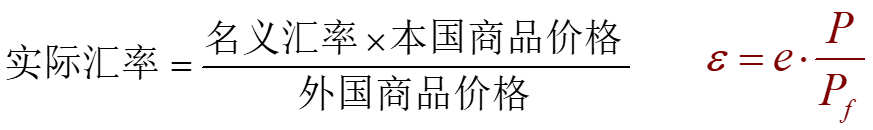
 

* **汇率制度**  
  * **固定汇率制**：一国货币与他国货币的汇率基本稳定，汇率波动被限制在一定范围内（美元和黄金挂钩，各国货币与美元挂钩）  
  * **浮动汇率制**：一国不规定本国货币与外国货币的官方汇率  

#### 3、国际收支的平衡  
* **净出口函数**
  
<strong>NX=X-M</strong>
  
  

  

  * 反向取决于**实际汇率**，反向取决于**国民收入F**  

* **资本净流出函数**  
  
<strong>F=流向外国的本国资本量-流向本国的外国资本量</strong>
  
  
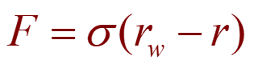
    
  
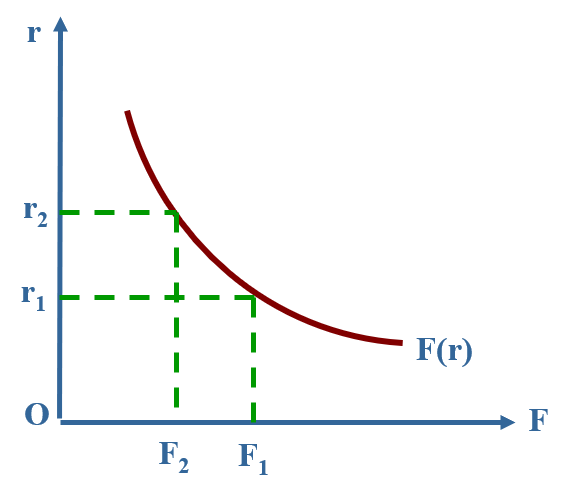
  

* **国际收支平衡：BP曲线**  
  

   
  

 

---  
### **二、蒙代尔-弗莱明模型**  
#### 1、基本假设  
* 资本能**完全流动**的**小型开放经济**  
* 国内市场利率与国外市场利率完全一致  

#### 2、开放经济的IS曲线  
  
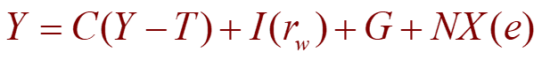
 

#### 3、开放经济的LM曲线  
  

  

#### 4、蒙代尔-弗莱明模型  
* **价格变动**下的蒙代尔-弗莱明模型
* **资本完全流动**的**小型**开放经济
  
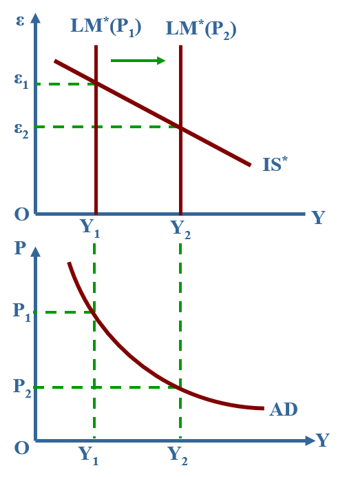
  

  物价下降->实际货币供给增加->LM右移->货币市场产出增加

---  
### **三、固定汇率制下国际收支调整**  
#### 1、固定汇率制下的财政政策  
* **扩张性财政政策**的直接结果是**引起总需求扩大**，IS*曲线向右移动，**汇率面临上升压力**  
  
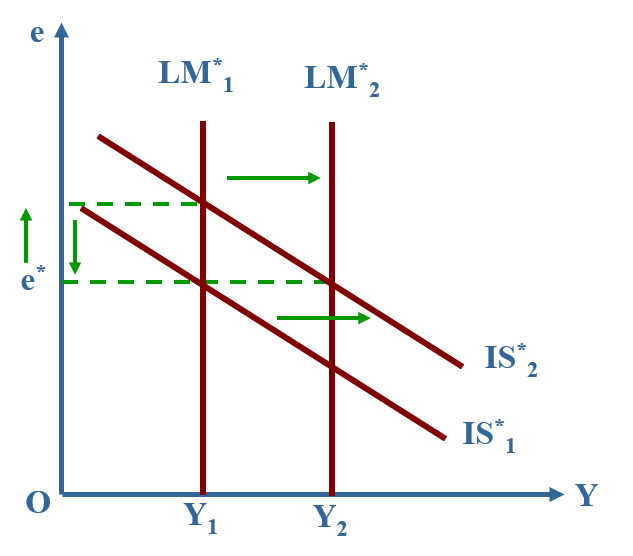
  
  
扩张性财政政策->产出增加->货币需求增加->利率上升->国外资本流入->本币升值->汇率上升
  
  
中央为维持汇率不变，只能干预外汇市场，增加货币供给，LM曲线右移，随之产出增大
  

#### 2、固定汇率制下的货币政策  
* **扩张性货币政策**的初始影响是使**LM*曲线右移**，**汇率降低  
* 但中央银行为维持汇率不变，不得不缩减货币供给，使LM*回到原来状态  
  
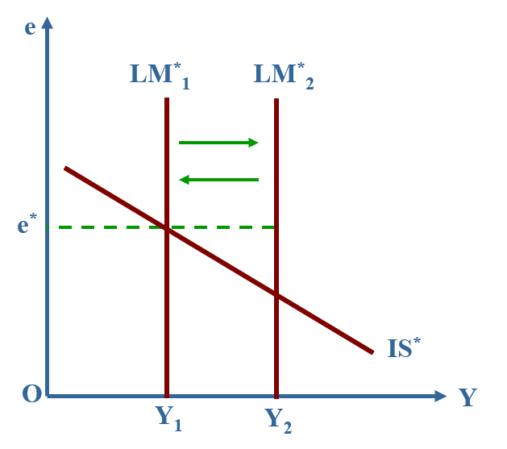
   
* **固定汇率制**下，**货币政策无效**  

#### 3、固定汇率制下的贸易政策  
* 通过**减少进口**进而**增加净出口**  
* **净出口曲线右移**->**IS*曲线右移**
---  
### **四、浮动汇率制下国际收支调整**  
#### 1、浮动汇率制下的财政政策  
* 政府采取**扩张性财政政策**，**IS*曲线右移**，**汇率上升**  
* LM*曲线无变化，故**产出无变化**  
    
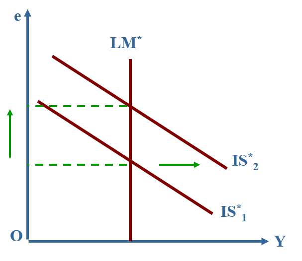
   

#### 2、浮动汇率制下的货币政策  
* 政府采取**扩张性货币政策**，**LM*曲线右移**，**名义汇率下降**，**产出增强**  
  
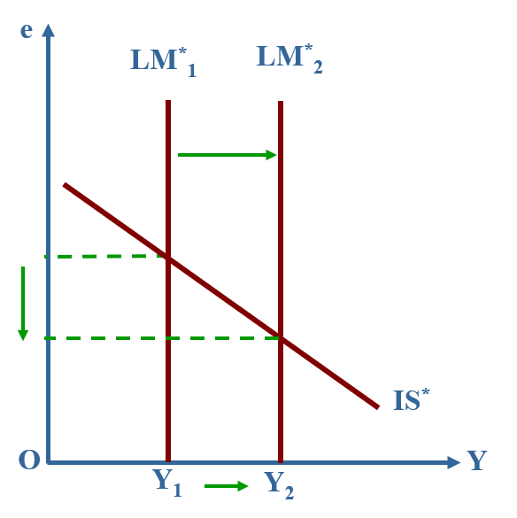
   
  
货币供给增加->本国利率下降->本国资本外流->国内利率回升
  
  
本国资本外流->外汇市场本国货币供给增加->名义汇率下降->净出口增加->总需求增加
  

#### 3、浮动汇率制下的贸易政策  
* 政府**增加净出口**，使得**IS*曲线右移**  
* **汇率上升，产出无变化**  

---
---
# END &emsp;o(*￣▽￣*)ブ 🐣
